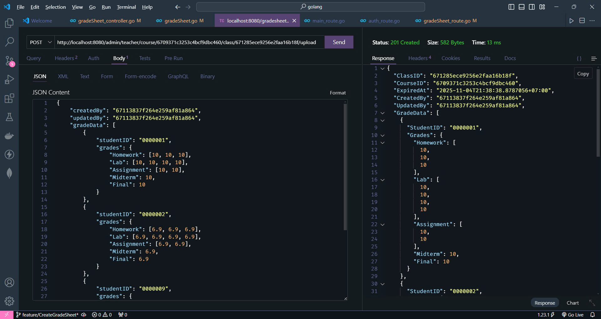
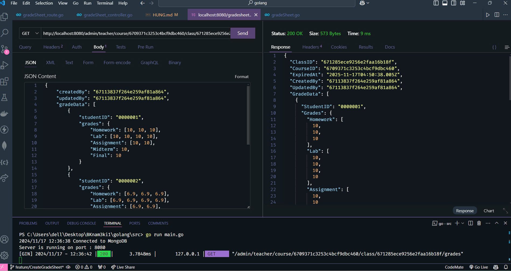

# Intro POST about *CreateGradeSheet* :ghost:

#### In this situation, I will introduce you about changes I got:

- I do not want to create Cluster for mongoDB. This is for leader I create localHost and change .env. You can change it if you want 
- I create struct Model of Grade in models/gradeSheet.go
- I create POST in controller/admin/gradeSheet_controller.go
    **UPDATE**: *11/04/2024*
    - I added courseIDStr vs classIDStr from URL that I get from front-end. Expired-date I added 1 year. ID of GradeSheet will be created automatically

    
    
    
- I create GET in controller/admin/gradeSheet_controller.go

    - Because I do not have any ID about Student and Class. I create Random
    - I also change router/main_route.go with 
        "GradeSheet(adminGroup)
	     AuthRoutes(adminGroup)"
    - I do not have time to unit test. Talk to me if you want
    => I hope you enjoy it. If you consider about what I code. Do not hesitate to contact me!!

:smile: 

