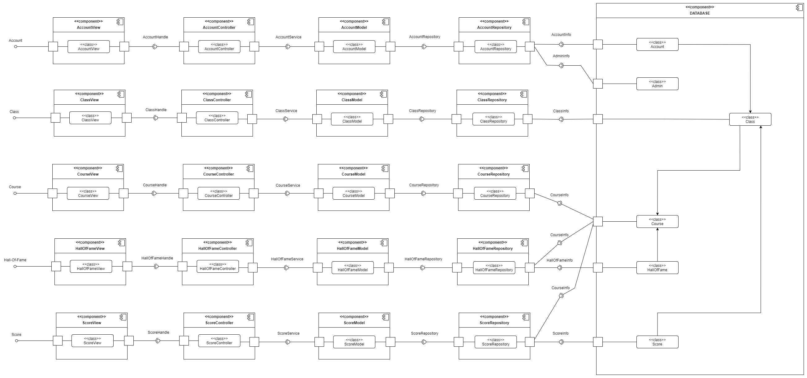
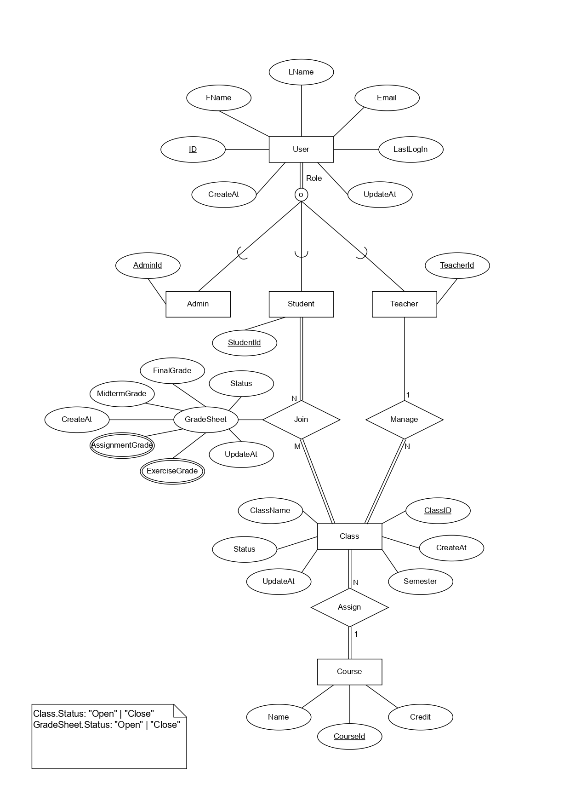
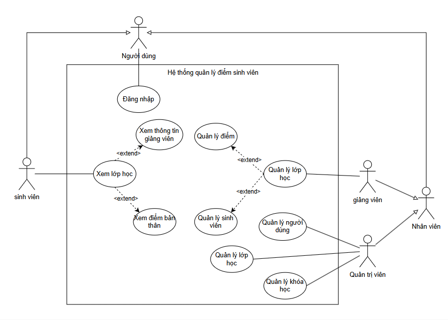
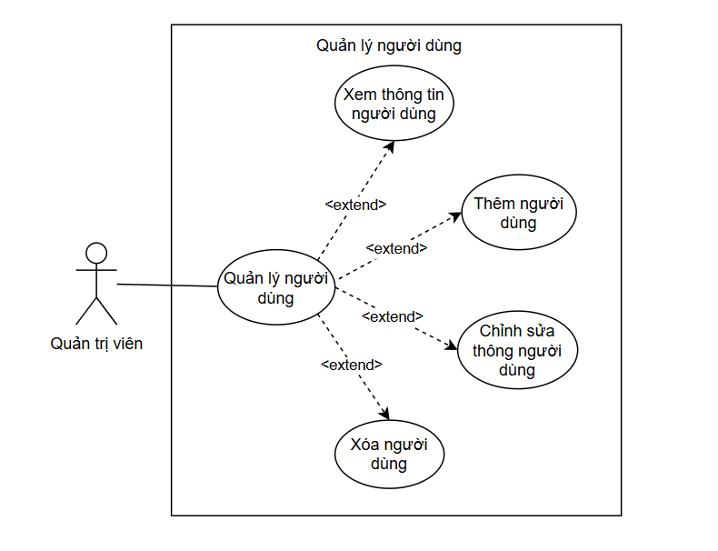
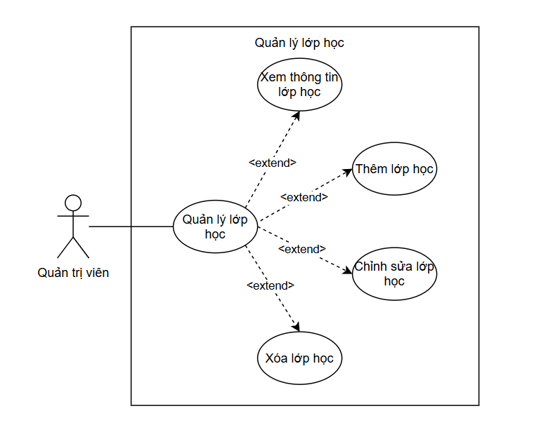
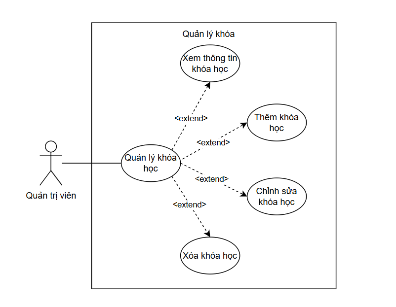
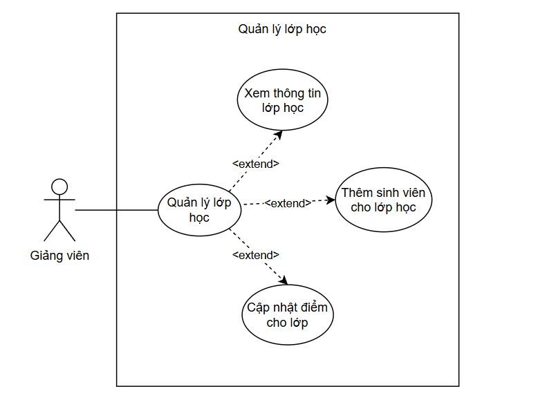
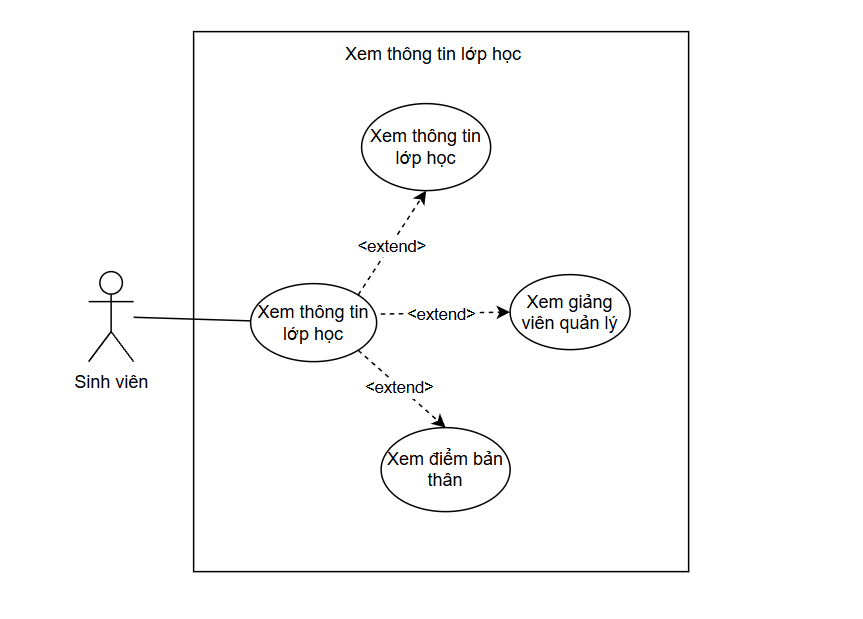
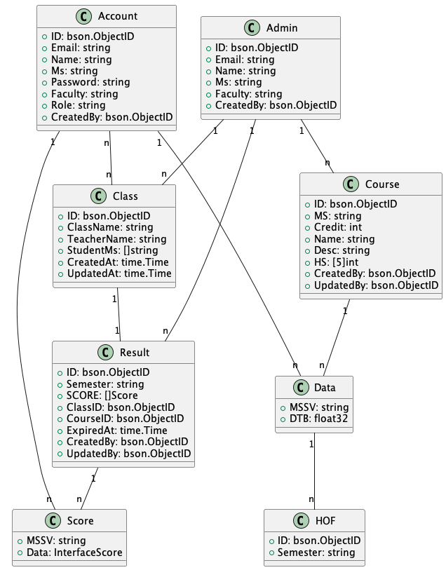

## ĐỒ ÁN TỔNG HỢP: HƯỚNG CÔNG NGHỆ PHẦN MỀM  

# BÁO CÁO ĐỒ ÁN  

## CHỦ ĐỀ: GRADE PORTAL BACKEND GO 2  

| **STT** | **Họ và Tên**          | **MSSV**  | **Vai Trò**            |
|---------|-------------------------|-----------|------------------------|
| 1       | Chu Minh Tâm            | 2213009   | Product Owner          |
| 2       | Nguyễn Trọng Kha        | 2211417   | Developer              |
| 3       | Nguyễn Tiến Phát        | 2212527   | Developer              |
| 4       | Nguyễn Ngọc Diệu Hà     | 2210846   | Developer              |
| 5       | Lê Hoàng Ngọc Hân       | 2210935   | Developer              |
| 6       | Nguyễn Phúc Hưng        | 2211368   | Developer              |
| 7       | Huỳnh Thanh Tâm         | 2213012   | Developer              |

---

# Functional & Non-Functional Requirements

## Functional Requirements

- **Đối với Admin**
  - Đăng nhập vào/đăng xuất khỏi hệ thống.
  - Tạo tài khoản admin mới, cấp quyền quản trị cho các tài khoản khác khi cần thiết.
  - Xem thông tin hồ sơ của mình, bao gồm các thông tin cá nhân và quyền hạn trong hệ thống.
  - Tạo, cập nhật, xóa và xem thông tin chi tiết của tài khoản giảng viên/sinh viên.
  - Xem danh sách tài khoản của tất cả giảng viên/sinh viên.
  - Tạo, cập nhật, xóa, và xem thông tin chi tiết của lớp học/khoá học.
  - Xem danh sách các khoá học/lớp học của giảng viên giảng dạy/sinh viên theo học.
  - Thêm sinh viên vào lớp học.
  - Cập nhật danh sách Hall of Fame cũng như xem danh sách Hall of Fame của các học kì.
  - Tạo và xem kết quả điểm số của các lớp học.

- **Đối với Giảng viên**
  - Đăng nhập vào/đăng xuất khỏi hệ thống.
  - Xem thông tin hồ sơ của mình, bao gồm các thông tin cá nhân và quyền hạn trong hệ thống.
  - Xem thông tin chi tiết lớp học/khoá học mà giảng viên giảng dạy.
  - Xem danh sách Hall of Fame của khoá học mà giảng viên giảng dạy của các học kì.
  - Tạo, cập nhật và xem kết quả điểm số của cả lớp học hoặc một sinh viên cụ thể mà giảng viên giảng dạy.

- **Đối với Sinh viên**
  - Đăng nhập vào/đăng xuất khỏi hệ thống.
  - Xem thông tin hồ sơ của mình, bao gồm các thông tin cá nhân và quyền hạn trong hệ thống.
  - Xem thông tin chi tiết lớp học/khoá học mà sinh viên theo học.
  - Xem danh sách Hall of Fame các khoá học mà sinh viên theo học của các học kì.
  - Chỉ được xem kết quả điểm số của chính mình.

## Non-Functional Requirements

- **Performance (Hiệu năng)**
  - Hệ thống phải phản hồi nhanh chóng trong điều kiện tải thông thường.
  - Hệ thống phải xử lý được nhiều yêu cầu đồng thời từ người dùng mà không bị suy giảm hiệu năng.

- **Security (Bảo mật)**
  - Áp dụng xác thực dựa trên token cho tất cả các route được bảo vệ.
  - Phân quyền rõ ràng: Admin chỉ được truy cập route `/admin`, giảng viên và sinh viên bị giới hạn trong route `/client`.
  - Sử dụng HTTPS để đảm bảo giao tiếp an toàn.

- **Scalability (Khả năng mở rộng)**
  - Hệ thống phải hỗ trợ mở rộng theo chiều ngang để xử lý lưu lượng tăng cao.
  - Cơ sở dữ liệu phải xử lý hiệu quả khi số lượng bản ghi (tài khoản, lớp học, kết quả) tăng lên.

- **Reliability (Độ tin cậy)**
  - Hệ thống cần đảm bảo 99.9% thời gian hoạt động với cơ chế xử lý lỗi mạnh mẽ.
  - Dữ liệu phải được được backup và khôi phục nhanh chóng trong trường hợp xảy ra sự cố.

- **Maintainability (Tính dễ bảo trì)**
  - Cấu trúc module rõ ràng giúp dễ dàng bảo trì và cập nhật.
  - Tuân thủ tiêu chuẩn coding và tài liệu hóa đầy đủ cho các API.

- **Usability (Tính thân thiện Người dùng)**
  - Cung cấp thông báo lỗi rõ ràng khi thao tác thất bại (ví dụ: đăng nhập không thành công, truy cập bị từ chối).
  - Đảm bảo các API RESTful với tên gọi nhất quán để dễ tích hợp.

- **Compatibility (Tính tương thích)**
  - Đảm bảo tương thích với các framework frontend phổ biến (ReactJS, Angular, v.v.).
  - API hỗ trợ định dạng JSON cho các request và response payload.

---

# Sơ đồ thành phần

  
   
  <i>Hình 1: Component Diagram</i>

### Các thành phần chính
- View: Giao diện sinh viên, giảng viên và admin, lớp học, khóa học và danh sách sinh viên có điểm số cao nhất. Riêng admin có giao diện tạo mới, sửa, xóa tài khoản, lớp học, khóa học. Khi người dùng gửi yêu cầu từ giao diện sẽ gọi đến dịch vụ ở lớp dưới.
- Controller: Tiếp nhận và xử lý các yêu cầu từ component View, sau đó chuyển yêu cầu tới các dịch vụ ở component tiếp theo.
- Model: Thực hiện các dịch vụ được yêu cầu và tương tác với kho dữ liệu để đáp ứng dịch vụ đó.
- Repository: Cung cấp dữ liệu cho các dịch vụ và thực hiện các thao tác trên cơ sở dữ liệu.
Database: Chứa các dữ liệu "tài khoản", "lớp học", "khóa học", "môn học", "danh sách sinh viên cao điểm nhất", các dữ liệu này phụ thuộc vào thông tin từ người dùng.
---

### Thiết kế CSDL

  
   
  <i>Hình 2: EERD</i>

1. Trong layered architecture, database sẽ là lớp ở dưới cùng và sẽ chịu trách nhiệm lưu trữ toàn bộ data và xử lý chúng. Các dữ liệu của ứng dụng sẽ  được lưu trữ tại đây và các thao tác như search, insert, update and delete sẽ được thực hiện thường xuyên để thao tác với dữ liệu thông qua hệ quản trị cơ sở dữ liệu.
2. Đối với đồ án lần này, nhóm sẽ sử dụng kiến trúc lớp với database layer lưu trữ dữ liệu bằng MongoDB, một hệ cơ sở dữ liệu NoSQL, các kiểu thực thể cần thiết sẽ có các thuộc tính như trên hình.
### Usecase Diagram
#### Whole System

  
   
  <i>Hình 3: Usecase toàn bộ hệ thống</i>

#### Quản trị viên
##### Quản lý người dùng

  
   
  <i>Hình 4: Usecase quản lý người dùng</i>

| Use-case ID     | UC-1                                                        |
|-------------------|---------------------------------------------------------------------------|
| Use-case name     | Quản lý người dùng                                                        |
| Actor             | Quản trị viên                                                             |
| Description       | Quản trị viên quản lý tài khoản sinh viên, giảng viên cũng như quản trị viên khác |
| Preconditions     | Đang đăng nhập với vai trò là quản trị viên                                                            | 
| Normal Flow       | 1. Quản trị viên chọn quản lý tài khoản    2. Quản trị viên có thể chọn thêm tài khoản, xem chi tiết 1 tài khoản, chỉnh sửa 1 tài khoản và xóa 1 tài khoảng bất kì.                                                        |
| Exceptions        | Không có                                                            |

##### Quản lý lớp học

  
   
  <i>Hình 5: Usecase quản lý lớp học của quản trị viên</i>

| Use-case ID     | UC-2                                                        |
|-------------------|---------------------------------------------------------------------------|
| Use-case name     | Quản lý lớp học của quản trị viên                                                        |
| Actor             | Quản trị viên                                                             |
| Description       | Quản trị viên quản lý lớp học |
| Preconditions     | Đang đăng nhập với vai trò là quản trị viên                                                             | 
| Normal Flow       | 1. Quản trị viên chọn quản lý lớp học    2. Quản trị viên có thể chọn thêm lớp học, xem chi tiết 1 lớp học, chỉnh sửa 1 lớp học, thêm sinh viên vào lớp, phân bổ giảng viên quản lý và xóa 1 lớp học bất kì.                                                        |
| Exceptions        | Không có                                                            |

##### Quản lý khóa học

  
   
  <i>Hình 6: Usecase quản lý khóa học</i>

| Use-case ID     | UC-3                                                        |
|-------------------|---------------------------------------------------------------------------|
| Use-case name     | Quản lý khóa học                                                       |
| Actor             | Quản trị viên                                                             |
| Description       | Quản trị viên quản lý khóa học |
| Preconditions     | Đang đăng nhập với vai trò là quản trị viên                                                             | 
| Normal Flow       | 1. Quản trị viên chọn quản lý khóa học    2. Quản trị viên có thể chọn thêm khóa học, xem chi tiết 1 khóa học, chỉnh sửa 1 khóa học và xóa 1 lớp học bất kì.                                                        |
| Exceptions        | Không có                                                            |

#### Giảng viên

  
   
  <i>Hình 7: Usecase quản lý lớp học của giảng viên</i>

| Use-case ID     | UC-4                                                        |
|-------------------|---------------------------------------------------------------------------|
| Use-case name     | Quản lý lớp học của giảng viên                                                        |
| Actor             | Giảng viên                                                             |
| Description       | Giảng viên quản lý lớp học do mình phụ trách|
| Preconditions     | Đang đăng nhập với vai trò là giảng viên                                                            | 
| Normal Flow       | 1. Giảng viên chọn quản lý lớp học của mình    2. Giảng viên có thể chọn xem thông tin chi tiết lớp học, xem điểm lớp học và cập nhật điểm cho lớp học.                                                        |
| Exceptions        | Không có                                                            |

#### Sinh viên

  
   
  <i>Hình 8: Usecase xem thông tin lớp học</i>

| Use-case ID     | UC-5                                                        |
|-------------------|---------------------------------------------------------------------------|
| Use-case name     | Xem thông tin lớp học                                                        |
| Actor             | Sinh viên                                                             |
| Description       | Sinh viên xem thông tin lớp học mà mình tham gia|
| Preconditions     | Đang đăng nhập với vai trò là sinh viên                                                            | 
| Normal Flow       | 1. Sinh chọn xem lớp học của mình    2. Sinh có thể chọn xem thông tin chi tiết lớp học, xem tên và email giảng viên phụ trách lớp đó và xem điểm của mình.                                                        |
| Exceptions        | Không có                                                            |
### Class Diagram
# Component Diagram

## Class Diagram

**Giải thích:**
- **Class Account:** Lưu trữ thông tin về các tài khoản người dùng, bao gồm các thuộc tính như ID, Email, và vai trò (Sinh viên, Giảng viên, Quản trị viên).
- **Class Admin:** Đại diện cho quản trị viên của hệ thống, có quyền quản lý và tạo mới các tài khoản người dùng, lớp học, khóa học, v.v.
- **Class Course và Class:** Quản lý thông tin về lớp học và khóa học, bao gồm các thuộc tính như tên lớp, tên giảng viên, thông tin sinh viên, tên khóa học, và mô tả.
- **Class Result và Score:** Lưu trữ kết quả điểm số của sinh viên, đồng thời kết nối với lớp học và khóa học để liên kết điểm số với lớp học và khóa học tương ứng.

##  Công nghệ sử dụng trong dự án

###  Backend: Gin (Go Framework)
Gin Framework là nền tảng chính để xây dựng RESTful API, cung cấp:
- Định tuyến (Routing) nhanh và hiệu quả.
- Middleware (JWT, CORS, Logging).
- Xử lý lỗi (Error handling) và quản lý request/response.

###  Database: MongoDB
MongoDB là cơ sở dữ liệu NoSQL lưu trữ dữ liệu dưới dạng JSON hoặc BSON. Nó được sử dụng để quản lý các thông tin:
- Tài khoản người dùng: Email, vai trò (admin, teacher, student).
- Lớp học và khóa học: Thông tin về lớp học, khóa học, danh sách sinh viên.
- Kết quả học tập: Điểm số của sinh viên, dữ liệu bảng điểm.
- Hall of Fame: Danh sách sinh viên đạt thành tích cao.

###  JWT (JSON Web Token)
JWT được sử dụng để xác thực và phân quyền người dùng:
- Khi người dùng đăng nhập, hệ thống tạo ra một token (JWT) chứa thông tin người dùng (ID, vai trò, email).
- Token được gửi kèm trong header của các yêu cầu để xác minh quyền truy cập.
- Các vai trò (admin, teacher, student) sẽ quyết định quyền hạn.

### Git Action
GitHub Actions là một tính năng mạnh mẽ của GitHub, cho phép tự động hóa các workflow (quy trình làm việc) trực tiếp trong repository. Nó tích hợp CI/CD (Continuous Integration/Continuous Deployment) và các công việc tùy chỉnh khác như kiểm tra mã nguồn, triển khai ứng dụng, và quản lý tài nguyên. GitHub Actions giúp cải thiện hiệu suất phát triển phần mềm bằng cách tự động hóa các quy trình lặp lại và phức tạp.

### Chức năng
- **Tự động hóa quy trình phát triển:**
  - Build, test, và triển khai ứng dụng mỗi khi có thay đổi mã nguồn.
  - Hỗ trợ CI/CD để đảm bảo chất lượng sản phẩm và triển khai nhanh chóng.
  
- **Tích hợp và triển khai dễ dàng:**
  - Làm việc trực tiếp với repository trên GitHub.
  - Hỗ trợ nhiều ngôn ngữ lập trình và frameworks.

- **Quy trình làm việc linh hoạt:**
  - Tạo các workflow theo yêu cầu với tệp YAML.
  - Cấu hình chạy theo các sự kiện (push, pull request, schedule, v.v.).

## 3.5 Docker
Docker là một công cụ mạnh mẽ giúp quản lý các ứng dụng và môi trường triển khai.
- Docker giúp đóng gói ứng dụng và các phụ thuộc vào container, đảm bảo ứng dụng chạy nhất quán trên các môi trường khác nhau.
- Docker giúp triển khai nhanh chóng các dịch vụ và ứng dụng mà không cần cấu hình lại môi trường hệ thống.
- Docker Compose giúp quản lý nhiều container trong dự án, giúp dễ dàng triển khai các ứng dụng phức tạp với nhiều dịch vụ.

### CORS (Cross-Origin Resource Sharing)
- CORS được cấu hình để đảm bảo frontend có thể truy cập API từ các domain khác nhau, trong khi vẫn bảo mật hệ thống.
  - Chỉ định các phương thức HTTP được phép (GET, POST, PUT, DELETE).
  - Xác định danh sách các nguồn (origin) đáng tin cậy.
## Quy trình làm việc

## Milestones

### Phân tích yêu cầu và thiết kế API
- Xác định các yêu cầu chức năng và phi chức năng.
- Phân tích và xác định các endpoint cần thiết.
- Hoàn thành tài liệu thiết kế API (bao gồm các endpoint, mô tả, method, payload).

### Phát triển API từng phần
- Mỗi endpoint sẽ được phát triển, kiểm thử đơn vị (unit test), và tích hợp liên tục (CI/CD) trước thời hạn.

### Kiểm thử và tối ưu hóa API
- Kiểm thử chức năng (Functionality Testing).
- Xử lý các lỗi phát sinh.
- Tối ưu hóa hiệu suất API.

### Triển khai và hoàn thiện API
- Triển khai API lên môi trường staging và kiểm tra tích hợp cuối cùng.
- Hoàn thành triển khai API lên môi trường production.

## Report

### Báo cáo
- Các thành viên trong nhóm phải báo cáo tiến độ định kỳ vào mỗi tối thứ 7 hàng tuần, nếu có feature mới thì sẽ linh hoạt hơn và báo cáo đúng thời hạn được giao.
  
- Nội dung báo cáo:
  - Nhiệm vụ đã hoàn thành.
  - Khó khăn gặp phải trong quá trình phát triển.
  - Góp ý và ý tưởng đóng góp mới.

### Phương tiện làm việc
- Zalo, Github, Discord
