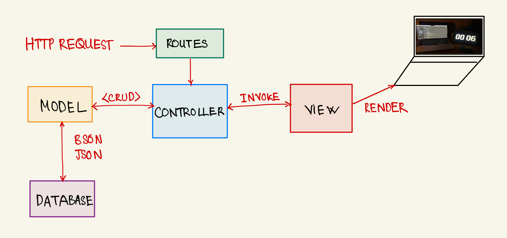
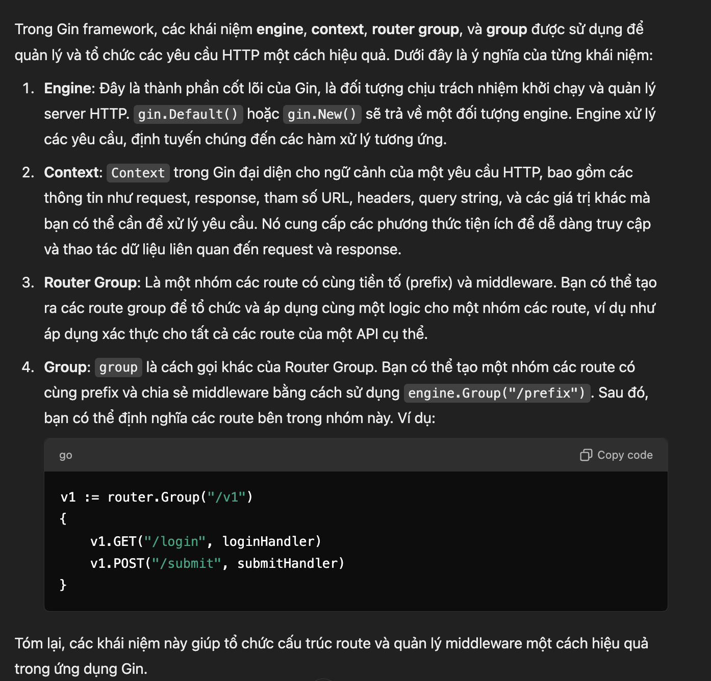
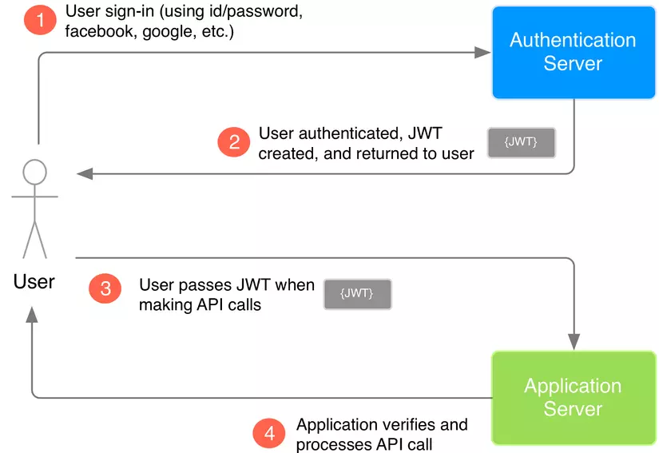

### MEETING MINUTE
### Week : `5`
- Thời gian: chiều, 10/11/2024
- Địa điểm: CS-2
- Chủ trì: PO- Chu Minh Tâm
- Tham gia: Tất cả thành viên nhóm
- Chủ đề: Kiểm tra bản hoàn thiện docs, giới thiệu kiến trúc hệ thống và bắt đầu phân công hiện thực.

### CÁCH HOẠT ĐỘNG CỦA HỆ THỐNG

- `Route` :
  - Định nghĩa các `URL` và liên kết với các `Controller` tương ứng.
  - `Route` sẽ gọi đến `Controller` khi có một yêu cầu HTTP được gửi đến.
- `Controller` :
  - `Controller` xử lý logic của yêu cầu HTTP (GET, POST, PUT, DELETE). Nó nhận dữ liệu từ `Middleware`, tương tác với các `model` và trả lại phản hồi cho `client`.
  - `Controller` chỉ thực hiện các tác vụ logic như xử lý dữ liệu, gửi phản hồi, hoặc tương tác với cơ sở dữ liệu.
- `Middleware` :
  - `Middleware` là các lớp trung gian xử lý yêu cầu trước khi chúng đến `Controller` hoặc sau khi `Controller` xử lý xong. Nó có thể thực hiện các tác vụ như xác thực, logging, hay sửa đổi yêu cầu.
  - `Middleware` hoạt động như bộ lọc, giúp bảo vệ và kiểm tra các yêu cầu trước khi chúng được định tuyến đến `Controller`.
- `model` : xử lý logic liên quan đến dữ liệu (`CRUD`- Create - Read - Update - Delete). `Controller` gọi đến `model` để thao tác với `Database`.

- `Response` : sau khi `Controller` nhận data từ `model`, nó sẽ gửi phản hồi (responese) lại cho `client` thông qua các `route` ban đầu.
  Quá trình này
### Gin 

### `Authentication`

### JWT

### Phân công chi tiết
# Hiện thực chức năng admin

### Admin:

- `Đăng nhập`: Cookie, Session, OAuth2.
- `Middleware` :

  - `Authentication`
  - `Validate`

  | STT | Tên       | Công việc                  |       
  | --- | --------- | -------------------------- | 
  | 1   | Hân       | `Teacher`             | 
  | 2   | Hà        |  `Student`             | 
  | 3   | Thanh Tâm |  `Course`              | 
  | 4   | Phát      |  `Admin`               | 
  | 5   | Kha       |  `Class`               | 
  | 6   | Minh Tâm  |  `Student` vào `Class` | 
  | 7   | Hưng      |  `Grade`               | 

  **Sau khi hoàn thành chức năng `POST` của `Admin` sẽ tiếp tục thực hiện các chức năng còn lại (PUT, GET, DELETE), sau đó sẽ đến `Student`, `Teacher`.**
